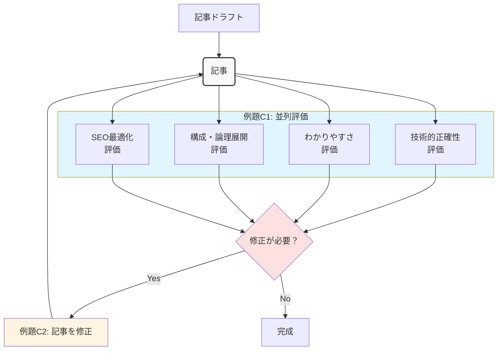

```mermaid
graph TD
    Start[記事ドラフト]
    
    %% 中間ノードを作成
    Article(記事)
    
    subgraph C1["例題C1: 並列評価"]
        direction TB
        Eval1[技術的正確性<br/>評価]
        Eval2[わかりやすさ<br/>評価]
        Eval3[構成・論理展開<br/>評価]
        Eval4[SEO最適化<br/>評価]
    end
    
    %% スタートと修正(C2)を「記事」に集約
    Start --> Article
    C2[例題C2: 記事を修正] --> Article
    
    %% 「記事」から各評価へ分配（ここが中間ポイント）
    Article --> Eval1
    Article --> Eval2
    Article --> Eval3
    Article --> Eval4
    
    %% 評価結果から判断(C3)へ
    Eval1 --> C3{修正が必要？}
    Eval2 --> C3
    Eval3 --> C3
    Eval4 --> C3
    
    %% 判断分岐
    C3 -->|Yes| C2
    C3 -->|No| End[完成]

    %% スタイル定義
    style C1 fill:#e1f5ff
    style C2 fill:#fff4e1
    style C3 fill:#ffe1e1
    style Article fill:#f9f9f9,stroke:#333,stroke-width:2px
```
