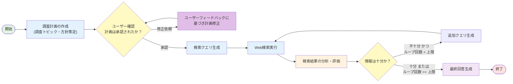

```mermaid
flowchart LR
    START([開始]) --> PLAN["調査計画の作成<br/>(調査トピック・方針策定)"]
    
    PLAN --> CONFIRM{ユーザー確認<br/>計画は承認されたか？}
    
    CONFIRM -->|修正依頼| REFINE["ユーザーフィードバックに<br/>基づき計画修正"]
    REFINE --> CONFIRM
    
    CONFIRM -->|承認| MAKE_QUERY["検索クエリ生成"]
    
    MAKE_QUERY --> SEARCH["Web検索実行"]
    
    SEARCH --> ANALYZE["検索結果の分析・評価"]
    
    ANALYZE --> CHECK{情報は十分か？}
    
    CHECK -->|不十分 かつ<br/>ループ回数 < 上限| ADD_QUERY["追加クエリ生成"]
    ADD_QUERY --> SEARCH
    
    CHECK -->|十分 または<br/>ループ回数 >= 上限| REPORT["最終回答生成"]
    
    REPORT --> END([終了])
    
    style START fill:#e1f5e1
    style END fill:#ffe1e1
    style PLAN fill:#e3f2fd
    style MAKE_QUERY fill:#e3f2fd
    style REFINE fill:#e1bee7
    style SEARCH fill:#e3f2fd
    style ANALYZE fill:#fff3e0
    style REPORT fill:#f3e5f5
    style CHECK fill:#fff9c4
    style CONFIRM fill:#fff9c4
```
