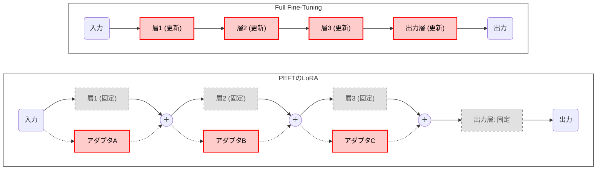

```mermaid
graph LR
    %% --- スタイル定義 ---
    %% update: 更新される層（赤背景・赤枠）
    classDef update fill:#ffcccc,stroke:#ff0000,stroke-width:2px,color:#000;
    %% frozen: 固定される層（グレー背景・点線枠）
    classDef frozen fill:#e1e1e1,stroke:#333,stroke-dasharray: 5 5,color:#555;

    %% --- PEFT / LoRA (差分のみ更新) ---
    subgraph PEFT ["PEFTのLoRA"]
        direction LR
        
        %% 入力
        R_In(入力)

        %% --- 層 1 ---
        R_In --> R_L1["層1 (固定)"]:::frozen
        R_In -.-> A1["アダプタA"]:::update
        R_L1 --> R_L1_Out((＋))
        A1 -.-> R_L1_Out

        %% --- 層 2 ---
        R_L1_Out --> R_L2["層2 (固定)"]:::frozen
        R_L1_Out -.-> A2["アダプタB"]:::update
        R_L2 --> R_L2_Out((＋))
        A2 -.-> R_L2_Out

        %% --- 層 3 ---
        R_L2_Out --> R_L3["層3 (固定)"]:::frozen
        R_L2_Out -.-> A3["アダプタC"]:::update
        R_L3 --> R_L3_Out((＋))
        A3 -.-> R_L3_Out

        %% 出力層
        R_L3_Out --> R_Head[出力層: 固定]:::frozen
        R_Head --> R_Out2(出力)
    end


    %% --- Full Fine-Tuning (すべて更新) ---
    subgraph FullFT ["Full Fine-Tuning"]
        direction LR
        
        F_In(入力)

        %% 全ての層が更新対象(updateクラス)
        F_In --> F_L1["層1 (更新)"]:::update
        F_L1 --> F_L2["層2 (更新)"]:::update
        F_L2 --> F_L3["層3 (更新)"]:::update
        
        %% 出力層も更新
        F_L3 --> F_Head["出力層 (更新)"]:::update
        F_Head --> F_Out(出力)
    end
    %% 全体のスタイル調整
    style FullFT fill:#fff,stroke:#333,margin:20px
    style PEFT fill:#fff,stroke:#333,margin:20px
```
