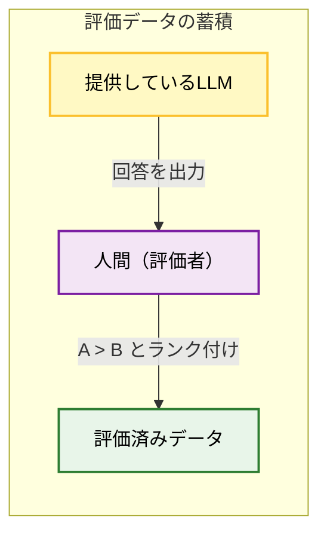

```mermaid
flowchart TD
    %% スタイル定義
    classDef base fill:#fff9c4,stroke:#fbc02d,stroke-width:2px,color:#000;
    classDef human fill:#f3e5f5,stroke:#7b1fa2,stroke-width:2px,color:#000;
    classDef data fill:#e8f5e9,stroke:#2e7d32,stroke-width:2px,color:#000;

    subgraph Common ["評価データの蓄積"]
        direction TB
        BaseModel["提供しているLLM"]:::base --> |"回答を出力"| Human["人間（評価者）"]:::human
        Human --> |"A > B とランク付け"| EvalData["評価済みデータ"]:::data
    end
```
