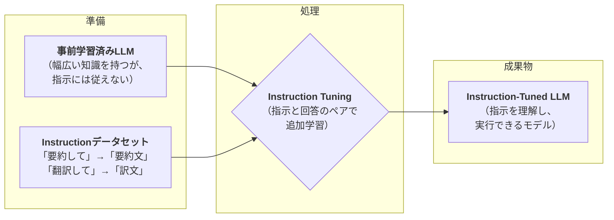

```mermaid
graph LR
    subgraph "準備"
        A[<b>事前学習済みLLM</b><br>（幅広い知識を持つが、<br>指示には従えない）]
        B[<b>Instructionデータセット</b><br>「要約して」→「要約文」<br> 「翻訳して」→「訳文」]
    end

    subgraph "処理"
        C{<b>Instruction Tuning</b><br>（指示と回答のペアで<br>追加学習）}
    end

    subgraph "成果物"
        D[<b>Instruction-Tuned LLM</b><br>（指示を理解し、<br>実行できるモデル）]
    end

    A --> C
    B --> C
    C --> D
```
