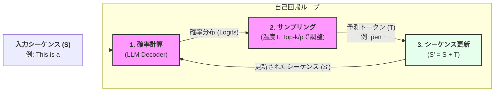

```mermaid
flowchart LR
    subgraph "自己回帰ループ"
        B["<b>1. 確率計算</b><br>(LLM Decoder)"]
        C["<b>2. サンプリング</b><br>(温度T, Top-k/pで調整)"]
        D["<b>3. シーケンス更新</b><br>(S' = S + T)"]
    end
    
    A["<b>入力シーケンス (S)</b><br>例: This is a"]
    
    A --> B
    
    B -- 確率分布 (Logits) --> C
    
    C -- "予測トークン (T)<br>例: pen" --> D
    
    D -- 更新されたシーケンス (S') --> B

    style B fill:#f9f,stroke:#333,stroke-width:2px
    style C fill:#f9f,stroke:#333,stroke-width:2px
    style D fill:#e6ffed,stroke:#333,stroke-width:2px
```
