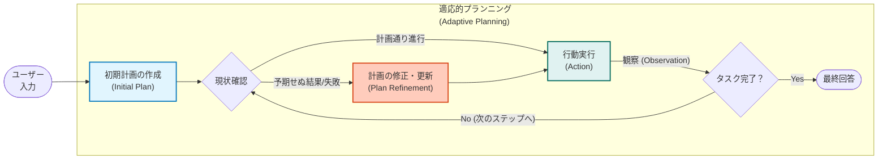

```mermaid
flowchart LR
    User(["ユーザー<br>入力"]) --> InitialPlan

    subgraph Adaptive_Process ["適応的プランニング<br>(Adaptive Planning)"]
        direction TB
        
        InitialPlan["初期計画の作成<br>(Initial Plan)"] --> CheckState
        
        CheckState{"現状確認"}
        
        CheckState -->|"計画通り進行"| Execute["行動実行<br>(Action)"]
        CheckState -->|"予期せぬ結果/失敗"| RefinePlan["計画の修正・更新<br>(Plan Refinement)"]
        
        RefinePlan --> Execute
        
        Execute -->|"観察 (Observation)"| ResultCheck{タスク完了？}
        
        ResultCheck -- "No (次のステップへ)" --> CheckState
        ResultCheck -- "Yes" --> Answer
    end

    Answer(["最終回答"])

    %% スタイル
    style InitialPlan fill:#e1f5fe,stroke:#0277bd,stroke-width:2px
    style RefinePlan fill:#ffccbc,stroke:#d84315,stroke-width:2px
    style Execute fill:#e0f2f1,stroke:#00695c,stroke-width:2px
```
