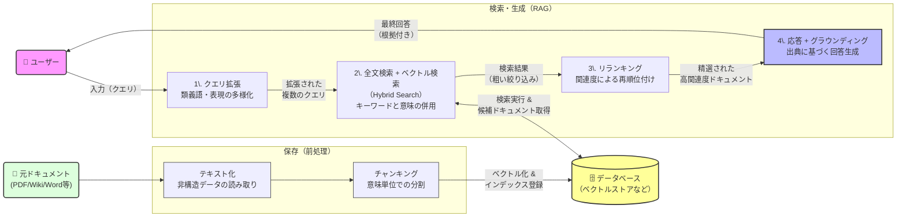

```mermaid
flowchart LR
    %% 外部エンティティ
    User("👤 ユーザー")
    SourceDocs("📄 元ドキュメント<br>(PDF/Wiki/Word等)")
    DB[("🗄️ データベース<br>（ベクトルストアなど）")]

    %% ドキュメント前処理 (Ingestion)
    subgraph Ingestion ["保存（前処理）"]
        direction TB
        Ingest1["テキスト化<br>非構造データの読み取り"]
        Ingest2["チャンキング<br>意味単位での分割"]
    end

    %% 検索・生成 (RAG Pipeline)
    subgraph RAG_Pipeline ["検索・生成（RAG）"]
        direction TB
        Step1["1\. クエリ拡張<br>類義語・表現の多様化"]
        Step2["2\. 全文検索 + ベクトル検索<br>（Hybrid Search）<br>キーワードと意味の併用"]
        Step3["3\. リランキング<br>関連度による再順位付け"]
        Step4["4\. 応答 + グラウンディング<br>出典に基づく回答生成"]
    end

    %% データフロー：前処理側
    SourceDocs --> Ingest1
    Ingest1 --> Ingest2
    Ingest2 -->|"ベクトル化 &<br>インデックス登録"| DB

    %% データフロー：RAG側
    User -->|"入力（クエリ）"| Step1
    Step1 -->|"拡張された<br>複数のクエリ"| Step2
    
    Step2 <-->|"検索実行 &<br>候補ドキュメント取得"| DB
    
    Step2 -->|"検索結果<br>（粗い絞り込み）"| Step3
    Step3 -->|"精選された<br>高関連度ドキュメント"| Step4
    
    Step4 -->|"最終回答<br>（根拠付き）"| User

    %% スタイル定義
    style User fill:#f9f,stroke:#333,stroke-width:2px
    style SourceDocs fill:#dfd,stroke:#333,stroke-width:2px
    style DB fill:#ff9,stroke:#333,stroke-width:2px
    style Step4 fill:#bbf,stroke:#333,stroke-width:2px
    
    %% 前処理系の色分け（緑系）
    style Ingest1 fill:#eef,stroke:#333
    style Ingest2 fill:#eef,stroke:#333
```
