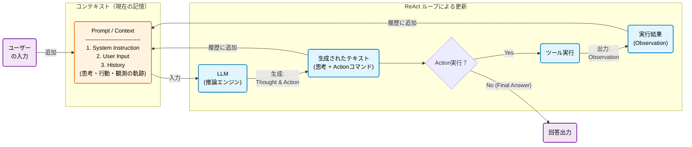

```mermaid
graph LR
    %% スタイル定義
    classDef memory fill:#fff3e0,stroke:#ef6c00,stroke-width:2px,color:black;
    classDef action fill:#e1f5fe,stroke:#0277bd,stroke-width:2px,color:black;
    classDef input fill:#f3e5f5,stroke:#7b1fa2,stroke-width:2px,color:black;

    subgraph "コンテキスト（現在の記憶）"
        ContextNode("Prompt / Context<br/>-----------------------------<br/>1. System Instruction<br/>2. User Input<br/>3. History<br> (思考・行動・観測の軌跡)"):::memory
    end

    UserIn("ユーザー<br>の入力"):::input --> |"追加"| ContextNode
    
    subgraph "ReAct ループによる更新"
        ContextNode --> |"入力"| LLM("LLM<br> (推論エンジン)"):::action
        
        %% 直前の議論を反映し、Actionコマンドであることを明記
        LLM --> |"生成: <br>Thought & Action"| GenText("生成されたテキスト<br/>(思考 + Actionコマンド)"):::action
        
        GenText --> |"履歴に追加"| ContextNode
        
        GenText --> Check{"Action実行？"}
        Check -- "Yes" --> Tool("ツール実行"):::action
        Tool --> |"出力: <br>Observation"| ObsResult("実行結果<br> (Observation)"):::action
        
        ObsResult --> |"履歴に追加"| ContextNode
    end

    Check -- "No (Final Answer)" --> Finish("回答出力"):::input
```
