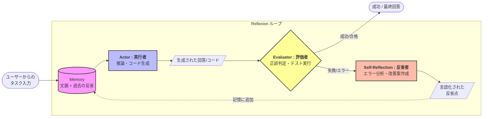

```mermaid
graph LR
    %% ノードの定義
    Start([ユーザーからの<br>タスク入力])
    
    subgraph Reflexion_Process [Reflexion ループ]
        direction TB
        Context[(Memory<br/>文脈 + 過去の反省)]
        Actor[<b>Actor : 実行者</b><br/>推論・コード生成]
        Output[/生成された回答/コード/]
        Evaluator{<b>Evaluator : 評価者</b><br/>正誤判定・テスト実行}
        Reflection[<b>Self-Reflection : 反省者</b><br/>エラー分析・改善案作成]
        Feedback[/言語化された<br>反省点/]
    end
    
    End([成功 / 最終回答])

    %% フローの接続
    Start --> Context
    Context --> Actor
    Actor --> Output
    Output --> Evaluator
    
    %% 条件分岐
    Evaluator -- 成功/合格 --> End
    Evaluator -- 失敗/エラー --> Reflection
    
    %% 反省のフィードバックループ
    Reflection --> Feedback
    Feedback -.->|記憶に追加| Context
    
    %% スタイル調整
    style Context fill:#f9f,stroke:#333,stroke-width:2px
    style Actor fill:#bbf,stroke:#333,stroke-width:2px
    style Evaluator fill:#ff9,stroke:#333,stroke-width:2px
    style Reflection fill:#fba,stroke:#333,stroke-width:2px
```
