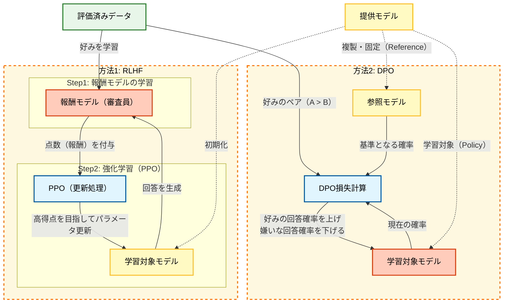

```mermaid
flowchart TD
    %% スタイル定義
    classDef base fill:#fff9c4,stroke:#fbc02d,stroke-width:2px,color:#000;
    classDef data fill:#e8f5e9,stroke:#2e7d32,stroke-width:2px,color:#000;
    classDef train fill:#e1f5fe,stroke:#01579b,stroke-width:2px,color:#000;
    classDef model fill:#ffccbc,stroke:#d84315,stroke-width:2px,color:#000;

    %% --- 外部入力 ---
    EvalData["評価済みデータ"]:::data
    BaseModel["提供モデル"]:::base

    %% === RLHF全体 ===
    subgraph RLHF_Whole ["方法1: RLHF"]
        style RLHF_Whole fill:#fff8e1,stroke:#ff6f00,stroke-width:2px,stroke-dasharray: 5 5,color:#000

        subgraph RLHF_Step1 ["Step1: 報酬モデルの学習"]
            RewardModel["報酬モデル（審査員）"]:::model
        end

        subgraph RLHF_Step2 ["Step2: 強化学習（PPO）"]
            direction TB
            RL_Model["学習対象モデル"]:::base
            PPO["PPO（更新処理）"]:::train
            
            RL_Model --> |"回答を生成"| RewardModel
            RewardModel --> |"点数（報酬）を付与"| PPO
            PPO --> |"高得点を目指してパラメータ更新"| RL_Model
        end
    end

    %% 外部からの接続
    EvalData --> |"好みを学習"| RewardModel
    BaseModel -.-> |"初期化"| RL_Model

    %% === DPO全体 ===
    subgraph DPO_Whole ["方法2: DPO"]
        style DPO_Whole fill:#fff8e1,stroke:#ff6f00,stroke-width:2px,stroke-dasharray: 5 5,color:#000

        RefModel["参照モデル"]:::base
        DPO_Model["学習対象モデル"]:::model
        LossCalc["DPO損失計算"]:::train
        
        %% 内部の計算フロー
        RefModel --> |"基準となる確率"| LossCalc
        DPO_Model --> |"現在の確率"| LossCalc
        
        LossCalc --> |"好みの回答確率を上げ<br>嫌いな回答確率を下げる"| DPO_Model
    end

    %% 外部からの接続
    EvalData --> |"好みのペア（A > B）"| LossCalc
    BaseModel -.-> |"複製・固定（Reference）"| RefModel
    BaseModel -.-> |"学習対象（Policy）"| DPO_Model
```
